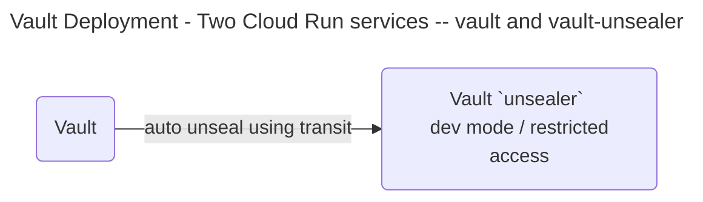

# Overview

2 AMD based Compute VMs with 1/8 OCPU** and 1 GB memory each

Arm-based Ampere A1 cores and 24 GB of memory usable as 1 VM or
 up to 4 VMs with 3,000 OCPU hours and 18,000 GB hours per month

VM.Standard.E2.1.Micro
 - 1 ocpu
 - 1 gb mem
 - 2 consul server nodes
 - one of the nodes could host the vault auto unseal instance

1 ampere based VMs for vault
 - 2 core
 - 4 gb mem
 - 1 vault server

## Architecture

consul kv
 - /{{ hostname }}/
    /acl-client-token - this makes vault a requirement

### VM deployment services and apps

consul template service
 - render 

